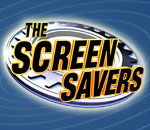

<ul class="th-grid-likes">
  <li>
    
Steve WozniakCreator of the Apple I

  </li>
  <li>
    
Jeri EllsworthSelf-taught engineer and pinball aficionado

  </li>
  <li>
    
Ready Player One

  </li>
  <li>
    
Tech SNAPSystem Network Administrator Podcast

  </li>
  <li>
    
Dual CoreNerdcore

  </li>
  <li>
    
Cyanide & Happiness

  </li>
  <li>
    
<a href="http://ripremix.com/">RiP!: A Remix Manifesto</a>

  </li>
  <li>
    
xkcd

  </li>
  <li>
    
The Art of Deceptionby <a href="http://en.wikipedia.org/wiki/Kevin_Mitnick">Kevin Mitnick</a>

  </li>
  <li>
    
Idiocracy

  </li>
  <li>
    
Futurama

  </li>
  <li>
    
The ScreenSaverson <a href="http://en.wikipedia.org/wiki/TechTV">TechTV</a>

  </li>
  <li>
    
<a href="http://theoatmeal.com/comics/tesla">Nikola Tesla</a>The world's greatest geek and mad scientist.

  </li>
</ul>
